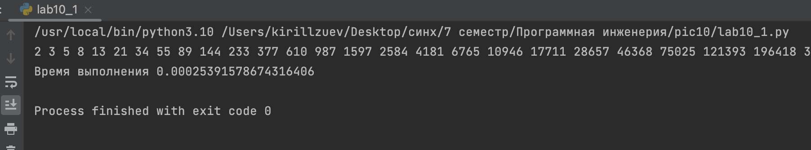
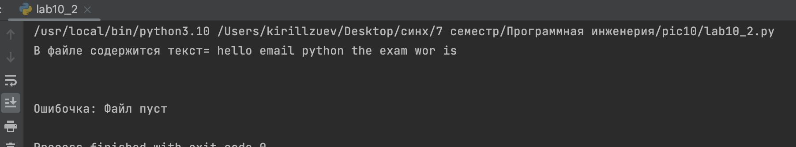
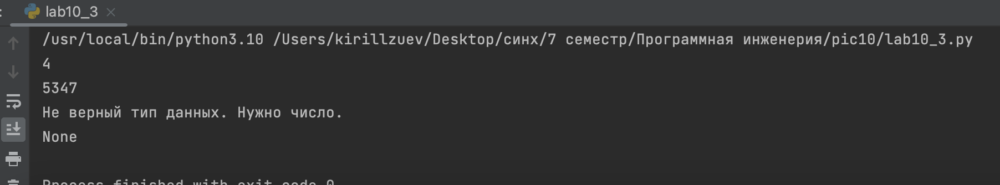
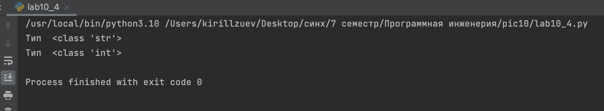
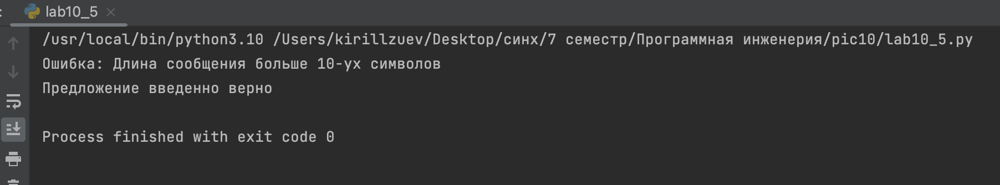

# Тема 10. Декораторы и исключения
 
Отчет по Теме #10 выполнил(а):
- Зуев Кирилл Андреевич
- ЗПИЭ-20-1

| Задание | Сам_раб |
| ------ | ------ | 
| Задание 1 | + | 
| Задание 2 | +| 
| Задание 3 | + |
| Задание 4 | + | 
| Задание 5 | + | 

знак "+" - задание выполнено; знак "-" - задание не выполнено;

Работу проверили:
-  к.э.н., доцент Панов М.А.

## Самостоятельная работа №1
### Вовочка решил заняться спортивным программированием на python, но для этого он должен знать за какое время выполняется его программа. Он решил, что для этого ему идеально подойдет декоратор для функции, который будет выяснять за какое время выполняется та или иная функция. Помогите Вовочке в его начинаниях и напишите такой декоратор.


```python
import time
def mesuare(q):
    def vova(*args, **kwargs):
        start = time.time()
        y = q(*args, **kwargs)
        end = time.time()
        x = end - start
        print(f'\nВремя выполнения {x} ')
        return y
    return vova
@mesuare
def fibonacci():
    fib1 = fib2 = 1
    for i in range(2, 200):
        fib1, fib2 = fib2, fib1 + fib2
        print(fib2, end=' ')

if __name__ == '__main__':
    fibonacci()

```
### Результат.

## Выводы

C помощью `mesuare_time()` можно замерять время выполнения.

## Самостоятельная работа №2
### Посмотрев на Вовочку, вы также загорелись идеей спортивного программирования, начав тренировки вы узнали, что для решения некоторых задач необходимо считывать данные из файлов. Но через некоторое время вы столкнулись с проблемой что файлы бывают пустыми, и вы не получаете вводные данные для решения задачи. После этого вы решили не просто считывать данные из файла, а всю конструкцию оборачивать в исключения, чтобы избежать такой проблемы. Создайте пустой файл и файл, в котором есть какая-то информация. Напишите код программы. Если файл пустой, то, нужно вызвать исключение (“бросить исключение”) и вывести в консоль “файл пустой”, а если он не пустой, то вывести информацию из файла.


```python
class Error(Exception):
    def __init__(self, text):
        self.message = text

def file(path, mode):
    try:
        with open(path, mode) as f:
            x = f.read()
            if x == '':
                raise Error('Файл пуст')
            else:
                print('В файле содержится текст=', x)
    except Error as error:
        print('Ошибочка:', error)

file('/Users/kirillzuev/Desktop/синх/7 семестр/Программная инженерия/pic10/1.txt', 'r')
file('/Users/kirillzuev/Desktop/синх/7 семестр/Программная инженерия/pic10/2.txt', 'r')

```
### Результат.


## Самостоятельная работа №3
### Напишите функцию, которая будет складывать 2 и введенное пользователем число, но если пользователь введет строку или другой неподходящий тип данных, то в консоль выведется ошибка “Неподходящий тип данных. Ожидалось число.”. Реализовать функционал программы необходимо через try/except и подобрать правильный тип исключения. Создавать собственное исключение нельзя. Проведите несколько тестов, в которых исключение вызывается и нет. Результатом выполнения задачи будет листинг кода и получившийся вывод в консоль


```python
def calcul(x):
    try:
        converted_value = int(x)

        return 2 + converted_value;
    except ValueError as error:
        print('Не верный тип данных. Нужно число.')

print(calcul(2))
print(calcul('5345'))
print(calcul('число'))

```
### Результат.


## Самостоятельная работа №4
### Создайте собственный декоратор, который будет использоваться для двух любых вами придуманных функций. Декораторы, которые использовались ранее в работе нельзя воссоздавать. Результатом выполнения задачи будет: класс декоратора, две как-то связанными с ним функциями, скриншот консоли с выполненной программой и подробные комментарии, которые будут описывать работу вашего кода.


```python
def calcul(x):
    try:
        converted_value = int(x)

        return 2 + converted_value;
    except ValueError as error:
        print('Не верный тип данных. Нужно число.')

print(calcul(2))
print(calcul('5345'))
print(calcul('число'))


```
### Результат.


## Выводы

Создал возврат типа с помощью декоратора.


   
## Самостоятельная работа №5
### Создайте собственное исключение, которое будет использоваться в двух любых фрагментах кода. Исключения, которые использовались ранее в работе нельзя воссоздавать. Результатом выполнения задачи будет: класс исключения, код к котором в двух местах используется это исключение, скриншот консоли с выполненной программой и подробные комментарии, которые будут описывать работу вашего кода.


```python
class soob(Exception):
    def __init__(self, message):
        self.message = message

def user(value):
    if len(value) < 11:
        raise soob('Длина сообщения больше 10-ух символов')

class mess:
    def __init__(self, mes):
        self.name = user(mes)

try:
    user('hello')
except soob as error:
    print('Ошибка:', error)

try:
    mess('helloworld..')
except soob as error:
    print('Ошибка:', error)

finally:
    print('Предложение введенно верно')

```
### Результат.

## Выводы

Создание кастомной ошибки


## Общие выводы по теме
Изучил декораторы в Python, они позволяют добавлять для функций дополнительную функциональность.


