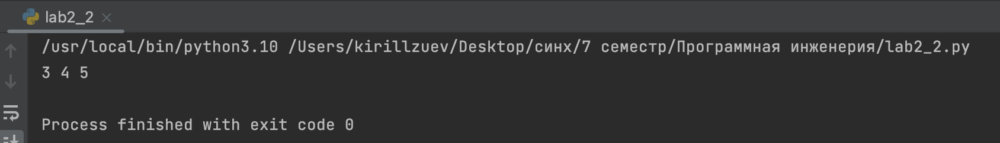

# Тема 2. Базовые операции языка Python
Отчет по Теме #2 выполнил(а):
- Зуев Кирилл Андреевич
- ЗПИЭ-20-1

| Задание | Сам_раб |
| ------ | ------ | 
| Задание 1 | + | 
| Задание 2 | +| 
| Задание 3 | + | 
| Задание 4 | + | 
| Задание 5 | + | 
| Задание 6 | + | 
| Задание 7 | + | 
| Задание 8 | + | 
| Задание 9 | + | 
| Задание 10 | + | 

знак "+" - задание выполнено; знак "-" - задание не выполнено;

Работу проверили:
-  к.э.н., доцент Панов М.А.

## Самостоятельная работа №1
### Выведите в консоль булевую переменную False, не используя слово False в строке или изначально присвоенную булевую переменную. Программа должна занимать не более двух строк редактора кода.
```python
a, b =1,2
print(a==b)
```
### Результат.


## Выводы

В данном коде выводятся две строки. Каждая строка содержит разные значения:

1. `a, b =1,2`: Присваивается переменным значения.

2. `print(a==b)`: Сравнивается две переменных и выводится булевое значение.

## Самостоятельная работа №2
### Присвоить значения трем переменным и вывести их в консоль, используя только две строки кода
```python
c, d, f =3,4,5
print(c,d,f)
```
### Результат.

## Выводы

В данном коде выводятся две строки. Каждая строка содержит разные значения:

1.  `c, d, f =3,4,5` : Присваивается переменным значения.

2. `print(c,d,f)`: Выводим значения переменных.


## Самостоятельная работа №3
### Реализуйте ввод данных в программу, через консоль, в виде только целых чисел (тип данных int). То есть при вводе буквенных символов в консоль, программа не должна работать.
```python
date = int(input('Какая сегодня дата'))
print(date)
```
### Результат.

## Выводы

В данном коде выводятся две строки. Каждая строка содержит разные значения:

1.  `date = int(input('Какая сегодня дата'))` : Вводим с консоли буквенное значение.

2. `print(date)`: Выводим значение переменной date и убеждаемся что выдает ошибку.

  
## Самостоятельная работа №4
### Создайте только одну строковую переменную. Длина строки должна не превышать 5 символов. На выходе мы должны получить строку длиной не менее 16 символов. Программа должна занимать не более двух строк редактора кода.
- Текст задания
- Оформленный код
- Скрины консоли
- Краткие Выводы

## Самостоятельная работа №5
### Создайте три переменные: день (тип данных - числовой), месяц (тип данных - строка), год (тип данных - числовой) и выведите в консоль текущую дату в формате: “Сегодня день месяц год. Всего хорошего!” используя F строку и оператор end внутри print(), в котором вы должны написать фразу “Всего хорошего!”. Программа должна занимать не более двух строк редактора кода.
- Текст задания
- Оформленный код
- Скрины консоли
- Краткие Выводы

## Самостоятельная работа №6
### В предложении ‘Hello World’ вставьте ‘my’ между двумя словами. Выведите полученное предложение в консоль в одну строку. Программа должна занимать не более двух строк редактора кода.
- Текст задания
- Оформленный код
- Скрины консоли
- Краткие Выводы

## Самостоятельная работа №7
### Узнайте длину предложения ‘Hello World’, результат выведите в консоль. Программа должна занимать не более двух строк редактора кода.
- Текст задания
- Оформленный код
- Скрины консоли
- Краткие Выводы

## Самостоятельная работа №8
### Переведите предложение ‘HELLO WORLD’ в нижний регистр. Программа должна занимать не более двух строк редактора кода.
- Текст задания
- Оформленный код
- Скрины консоли
- Краткие Выводы

## Самостоятельная работа №9
### Найти максимальное число из 3 переменных.
- Текст задания
- Оформленный код
- Скрины консоли
- Краткие Выводы

## Самостоятельная работа №10
### В слове 'abc' выведите его с заглавной буквы.
- Текст задания
- Оформленный код
- Скрины консоли
- Краткие Выводы

## Общие выводы по теме
- Развернутый вывод
