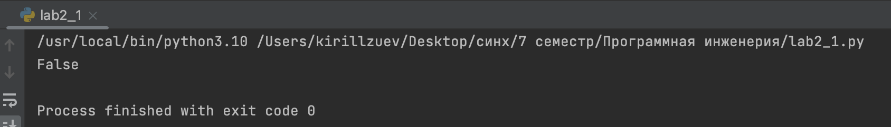
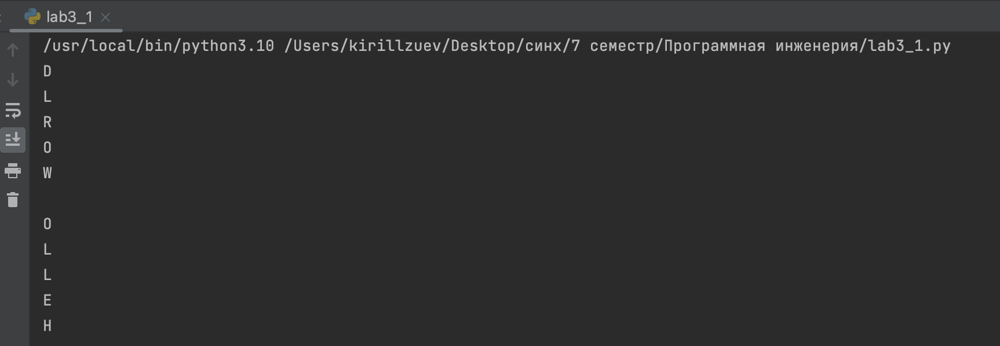
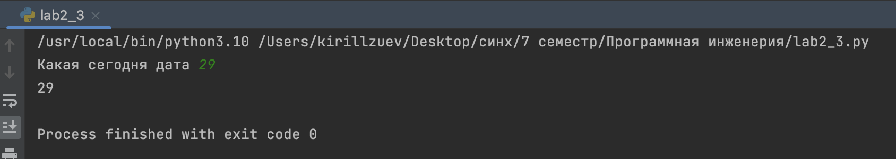

# Тема 3. Операторы, ,условия ,циклы 
Отчет по Теме #3 выполнил(а):
- Зуев Кирилл Андреевич
- ЗПИЭ-20-1

| Задание | Сам_раб |
| ------ | ------ | 
| Задание 1 | + | 
| Задание 2 | +| 
| Задание 3 | + | 

знак "+" - задание выполнено; знак "-" - задание не выполнено;

Работу проверили:
-  к.э.н., доцент Панов М.А.

## Самостоятельная работа №1
### Выведите в консоль булевую переменную False, не используя слово False в строке или изначально присвоенную булевую переменную. Программа должна занимать не более двух строк редактора кода.
```python
a, b =1,2
print(a==b)
```
### Результат.


## Выводы

В данном коде выводятся две строки. Каждая строка содержит разные значения:

1. `a, b =1,2`: Присваивается переменным значения.

2. `print(a==b)`: Сравнивается две переменных и выводится булевое значение.

## Самостоятельная работа №2
### Напишите программу, которая фразу «Hello World» выводит в обратном порядке, и каждая буква находится в одной строке консоли. При этом необходимо обязательно использовать любой цикл, а также программа должна занимать не более 3 строк в редакторе кода.
```python
for elem in reversed('HELLO WORLD'):
print(elem)
```
### Результат.

## Выводы

В данном коде выводятся две строки. Каждая строка содержит разные значения:

1.  `c, d, f =3,4,5` : Присваивается переменным значения.

2. `print(c,d,f)`: Выводим значения переменных.


## Самостоятельная работа №3
###  Напишите программу, которая фразу «Hello World» выводит в обратном порядке, и каждая буква находится в одной строке консоли. При этом необходимо обязательно использовать любой цикл, а также программа должна занимать не более 3 строк в редакторе кода.
```python
for elem in reversed('HELLO WORLD'):
    print(elem)
```
### Результат.

## Выводы

В данном коде выводятся две строки. Каждая строка содержит разные значения:

1.  `date = int(input('Какая сегодня дата'))` : Вводим с консоли буквенное значение.

2. `print(date)`: Выводим значение переменной date и убеждаемся что выдает ошибку.


## Общие выводы по теме
Ознакомился с базовыми операциями python, установил pycharm и на учился создавать репозитории и работать в них.
