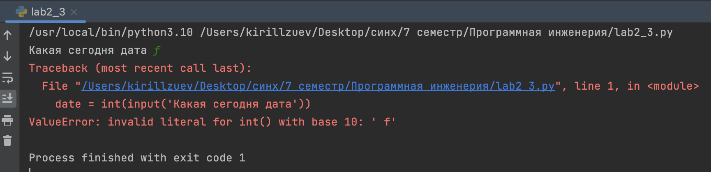

# Тема 3. Операторы, ,условия ,циклы 
Отчет по Теме #3 выполнил(а):
- Зуев Кирилл Андреевич
- ЗПИЭ-20-1

| Задание | Сам_раб |
| ------ | ------ | 
| Задание 1 | + | 
| Задание 2 | +| 
| Задание 3 | + |
| Задание 4 | + | 
| Задание 5 | + | 

знак "+" - задание выполнено; знак "-" - задание не выполнено;

Работу проверили:
-  к.э.н., доцент Панов М.А.

## Самостоятельная работа №1
### Напишите программу, которая преобразует 1 в 31. Для выполнения поставленной задачи необходимо обязательно и только один раз использовать:• Цикл for • *= 5 • += 1 Никаких других действий или циклов использовать нельзя.
```python
z=1
for z in range(7):
    z*=5
    z+=1
print(z)
```
### Результат.


## Выводы

В данном коде выводятся две строки. Каждая строка содержит разные значения:

1. `a, b =1,2`: Присваивается переменным значения.

2. `print(a==b)`: Сравнивается две переменных и выводится булевое значение.

## Самостоятельная работа №2
### Напишите программу, которая фразу «Hello World» выводит в обратном порядке, и каждая буква находится в одной строке консоли. При этом необходимо обязательно использовать любой цикл, а также программа должна занимать не более 3 строк в редакторе кода.
```python
for elem in reversed('HELLO WORLD'):
print(elem)
```
### Результат.

## Выводы

В данном коде выводятся две строки. Каждая строка содержит разные значения:

1.  `c, d, f =3,4,5` : Присваивается переменным значения.

2. `print(c,d,f)`: Выводим значения переменных.


## Самостоятельная работа №3
###  Напишите программу, на вход которой поступает значение из консоли, оно должно быть числовым и в диапазоне от 0 до 10 включительно (это необходимо учесть в программе). Если вводимое число не подходит по требованиям, то необходимо вывести оповещение об этом в консоль и остановить программу. Код должен вычислять в каком диапазоне находится полученное число. Нужно учитывать три диапазона: • от 0 до 3 включительно • от 3 до 6 • от 6 до 10 включительно Результатом работы программы будет выведенный в консоль диапазон. Программа должна занимать не более 10 строчек в редакторе кода.
```python
for elem in reversed('HELLO WORLD'):
    print(elem)
```
### Результат.

## Выводы

В данном коде выводятся две строки. Каждая строка содержит разные значения:

1.  `date = int(input('Какая сегодня дата'))` : Вводим с консоли буквенное значение.

2. `print(date)`: Выводим значение переменной date и убеждаемся что выдает ошибку.

## Самостоятельная работа №4
###  Манипулирование строками. Напишите программу на Python, которая принимает предложение (на английском) в качестве входных данных от пользователя. Выполните следующие операции и отобразите результаты: • Выведите длину предложения. • Переведите предложение в нижний регистр. • Подсчитайте количество гласных (a, e, i, o, u) в предложении. • Замените все слова "ugly" на "beauty". • Проверьте, начинается ли предложение с "The" и заканчивается ли на "end". Проверьте работу программы минимум на 3 предложениях, чтобы охватить проверку всех поставленных условий.
```python
for elem in reversed('HELLO WORLD'):
    print(elem)
```
### Результат.

## Выводы

В данном коде выводятся две строки. Каждая строка содержит разные значения:

1.  `date = int(input('Какая сегодня дата'))` : Вводим с консоли буквенное значение.

2. `print(date)`: Выводим значение переменной date и убеждаемся что выдает ошибку.
   
## Самостоятельная работа №5
###  Составьте программу, результатом которой будет данный вывод в консоль:
```python
for elem in reversed('HELLO WORLD'):
    print(elem)
```
### Результат.

## Выводы

В данном коде выводятся две строки. Каждая строка содержит разные значения:

1.  `date = int(input('Какая сегодня дата'))` : Вводим с консоли буквенное значение.

2. `print(date)`: Выводим значение переменной date и убеждаемся что выдает ошибку.


## Общие выводы по теме
Ознакомился с базовыми операциями python, установил pycharm и на учился создавать репозитории и работать в них.
