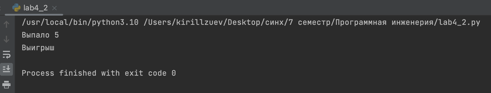
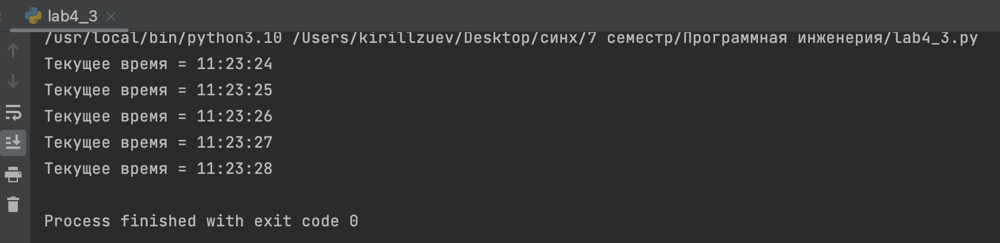
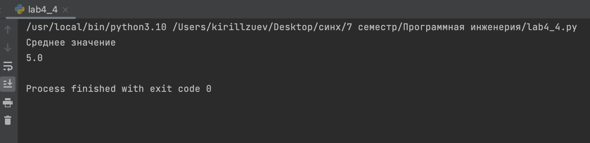

# Тема 4. Функции и модули 
Отчет по Теме #4 выполнил(а):
- Зуев Кирилл Андреевич
- ЗПИЭ-20-1

| Задание | Сам_раб |
| ------ | ------ | 
| Задание 1 | + | 
| Задание 2 | +| 
| Задание 3 | + |
| Задание 4 | + | 
| Задание 5 | + | 

знак "+" - задание выполнено; знак "-" - задание не выполнено;

Работу проверили:
-  к.э.н., доцент Панов М.А.

## Самостоятельная работа №1
### Дайте подробный комментарий для кода, написанного ниже. Комментарий нужен для каждой строчки кода, нужно описать что она делает. Не забудьте, что функции комментируются по-особенному.
```python
z=1
for z in range(7):
    z*=5
    z+=1
print(z)
```
### Результат.


## Выводы

В данном коде выводятся одна строка. Каждая строка содержит разные значения:

1. `z=1`: Присваивается переменной значение.

2. `for z in range(7):
    z*=5
    z+=1`: Цикл for с функцией range.
3. `print(z)`: Вывод переменной z.

## Самостоятельная работа №2
### Напишите программу, которая будет заменять игральную кость с 6 гранями. Если значение равно 5 или 6, то в консоль выводится «Вы победили», если значения 3 или 4, то вы рекурсивно должны вызвать эту же функцию, если значение 1 или 2, то в консоль выводится «Вы проиграли». При этом каждый вызов функции необходимо выводить в консоль значение “кубика”. Для выполнения задания необходимо использовать стандартную библиотеку random. Программу нужно написать, используя одну функцию и “точку входа”
```python
import random
def kubik():
    throw = random.randint(1, 6)
    print(f"Выпало {throw}")
    if throw == 1 or throw == 2:
        print("Проигрыш")
    elif throw == 5 or throw == 6:
        print("Выигрыш")
    else:
        print("Еще раз")
        kubik()
if __name__ == '__main__':
    kubik()
```
### Результат.

## Выводы

В данном коде выводится одна строка. Каждая строка содержит разные значения:

1.  `for elem in reversed('HELLO WORLD')` : Цикл for с функцией reversed.

2. `print(elem)`: Выводим значение переменной.


## Самостоятельная работа №3
###  Напишите программу, которая будет выводить текущее время, с точностью до секунд на протяжении 5 секунд. Программу нужно написать с использованием цикла. Подсказка: необходимо использовать модуль datetime и time, а также вам необходимо как-то “усыплять” программу на 1 секунду.
```python
from datetime import datetime
import time
collection = [1, 2, 3, 4, 5]
for i in collection:
        time.sleep(1)
        now = datetime.now()
        current_time = now.strftime("%H:%M:%S")
        print("Текущее время =", current_time)
```
### Результат.

## Выводы

Каждая строка содержит разные значения:

1.  `n=int(input('Введите от 0 до 10'))` : Вводим с консоли число от 0 до 10.

2. `if n < 0:
    print('Число меньше 0 не верно')
elif -1 < n < 4:
    print('От 0 до 3 включительно')
elif 3 < n < 5.5:
    print('От 3 до 6')
elif n>10:
    print('Число больше 10, введите от 0 до 10 включительно')
else: print('От 6 до 10 включительно')`: Условная конструкция if сравнивает вводимое число по нужным нам критериям и выводит текущий диапазон числа.

## Самостоятельная работа №4
###  Напишите программу, которая считает среднее арифметическое от аргументов вызываемое функции, с условием того, что изначальное количество этих аргументов неизвестно. Программу необходимо реализовать используя одну функцию и "точку входа".
```python
def average(*num):
    total = 0
    for q in num:
        total += q
    return total / len(num)

if __name__ == '__main__':
    res = average (4,6)
    print("Среднее значение")
    print(res)
```
### Результат.


## Выводы

Каждая строка содержит разные значения:

1.  `a=str (input('Введите предложение на английском '))` : Вводим с консоли предложение.

2. `print(len(a))`: Выводим значение переменной a количество символов.
3. `count = 0
vowels = set("aeiouAEIOA")
for letter in a:
    if letter in vowels:
        count += 1
print("Количество гласных равно:")
print(count)`: Подсчет глассных букв.
4. `b=a.replace ('ugly', 'beauty')
print(b)`: Замена слова ugly на beautu.
5. `prefixes = ('the')
print(b.startswith(prefixes))`: Проверяем начинается ли предложение с the.
6. `result = b.endswith('end')
print(result)`: Проверяем заканчивается ли предложение с end.
   
## Самостоятельная работа №5
###  Создайте два Python файла, в одном будет выполняться вычисление площади треугольника при помощи формулы Герона (необходимо реализовать через функцию), а во втором будет происходить взаимодействие с пользователем (получение всей необходимой информации и вывод результатов). Напишите эту программу и выведите в консоль полученную площадь.
#lab4_5_1
```python
def square_s(a, b, c):
    p = (a + b + c) / 2
    return (p * (p - a) * (p - b) * (p - c)) ** 0.5
```
#lab4_5_2
```python
from lab4_5_1 import square_s

a = int(input('Сторона а: '))
b = int(input('Сторона b: '))
c = int(input('Сторона c: '))
print('Площадь ровна =', square_s(a, b, c))
```
### Результат.

## Выводы

В данном коде выводятся две строки. Каждая строка содержит разные значения:

1.  `date = int(input('Какая сегодня дата'))` : Вводим с консоли буквенное значение.

2. `print(date)`: Выводим значение переменной date и убеждаемся что выдает ошибку.


## Общие выводы по теме
Ознакомился циклами python, логическими операциями.

