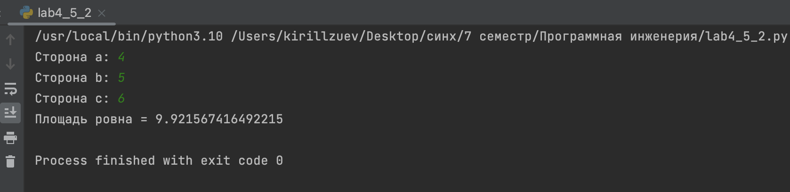

# Тема 4. Функции и модули 
Отчет по Теме #4 выполнил(а):
- Зуев Кирилл Андреевич
- ЗПИЭ-20-1

| Задание | Сам_раб |
| ------ | ------ | 
| Задание 1 | + | 
| Задание 2 | +| 
| Задание 3 | + |
| Задание 4 | + | 
| Задание 5 | + | 

знак "+" - задание выполнено; знак "-" - задание не выполнено;

Работу проверили:
-  к.э.н., доцент Панов М.А.

## Самостоятельная работа №1
### Дайте подробный комментарий для кода, написанного ниже. Комментарий нужен для каждой строчки кода, нужно описать что она делает. Не забудьте, что функции комментируются по-особенному.

```python
# Импортация класса datetime из datetime
from datetime import datetime
# Импортация функции sqrt из math
from math import sqrt

# создание функции
def main(**kwargs):
    """
     Функция выполняется по переданным параметрам,
    считает  выражение и выводит результат
    """
    # цикл по словарю
    for key in kwargs.items():
        # вычисляем результат
        result = sqrt(key[1][0] ** 2 + key[1][1] ** 2)
        # выводим в консоль полученный результат
        print(result)

# проверяем запускается модуль напрямую или импортируется
if __name__ == '__main__':
    # время начала
    start_time = datetime.now()
    # передача аргументов
    main(
        one=[10, 3],
        two=[5, 4],
        three=[15, 13],
        four=[93, 53],
        five=[133, 15]
    )
    # фиксируем время окончания и считаем изминение
    timecost = datetime.now() - start_time
    # выводим в консоль время 
    print(f"Время выполнения программы - {timecost}")

```

## Выводы

В данном задании научился оринтироваться в чужом коде.

## Самостоятельная работа №2
### Напишите программу, которая будет заменять игральную кость с 6 гранями. Если значение равно 5 или 6, то в консоль выводится «Вы победили», если значения 3 или 4, то вы рекурсивно должны вызвать эту же функцию, если значение 1 или 2, то в консоль выводится «Вы проиграли». При этом каждый вызов функции необходимо выводить в консоль значение “кубика”. Для выполнения задания необходимо использовать стандартную библиотеку random. Программу нужно написать, используя одну функцию и “точку входа”
```python
import random
def kubik():
    throw = random.randint(1, 6)
    print(f"Выпало {throw}")
    if throw == 1 or throw == 2:
        print("Проигрыш")
    elif throw == 5 or throw == 6:
        print("Выигрыш")
    else:
        print("Еще раз")
        kubik()
if __name__ == '__main__':
    kubik()
```
### Результат.

## Выводы

Познакомился с библилиотекой random, далее создал условие игры с помощью if.


## Самостоятельная работа №3
###  Напишите программу, которая будет выводить текущее время, с точностью до секунд на протяжении 5 секунд. Программу нужно написать с использованием цикла. Подсказка: необходимо использовать модуль datetime и time, а также вам необходимо как-то “усыплять” программу на 1 секунду.
```python
from datetime import datetime
import time
collection = [1, 2, 3, 4, 5]
for i in collection:
        time.sleep(1)
        now = datetime.now()
        current_time = now.strftime("%H:%M:%S")
        print("Текущее время =", current_time)
```
### Результат.

## Выводы

Поключил библиотеку time, сделал цикл, а так же узнал как засыплять программу.

## Самостоятельная работа №4
###  Напишите программу, которая считает среднее арифметическое от аргументов вызываемое функции, с условием того, что изначальное количество этих аргументов неизвестно. Программу необходимо реализовать используя одну функцию и "точку входа".
```python
def average(*num):
    total = 0
    for q in num:
        total += q
    return total / len(num)

if __name__ == '__main__':
    res = average (4,6)
    print("Среднее значение")
    print(res)
```
### Результат.


## Выводы

Реализавал функцию с произвольным количеством входящих аргументов для этого использовал *, далее была написана функция и оформлена точка входа.
   
## Самостоятельная работа №5
###  Создайте два Python файла, в одном будет выполняться вычисление площади треугольника при помощи формулы Герона (необходимо реализовать через функцию), а во втором будет происходить взаимодействие с пользователем (получение всей необходимой информации и вывод результатов). Напишите эту программу и выведите в консоль полученную площадь.
#lab4_5_1
```python
def square_s(a, b, c):
    p = (a + b + c) / 2
    return (p * (p - a) * (p - b) * (p - c)) ** 0.5
```
#lab4_5_2
```python
from lab4_5_1 import square_s

a = int(input('Сторона а: '))
b = int(input('Сторона b: '))
c = int(input('Сторона c: '))
print('Площадь ровна =', square_s(a, b, c))
```
### Результат.

## Выводы

В первой программе создал функцию, а во второй вызов этой функции и осуществлен ввод сторон треугольника и подсчитана площадь.


## Общие выводы по теме
Я получил знания и практические навыки по использованию внешних модулей, а тагже рассмотрел встроенные стандартные библиотеки.

