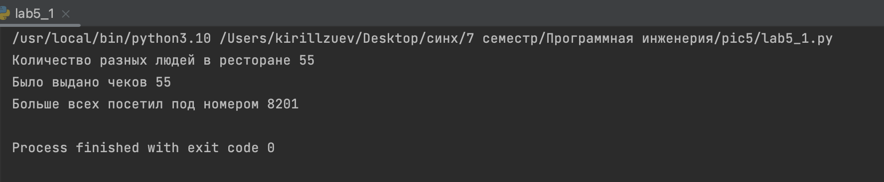
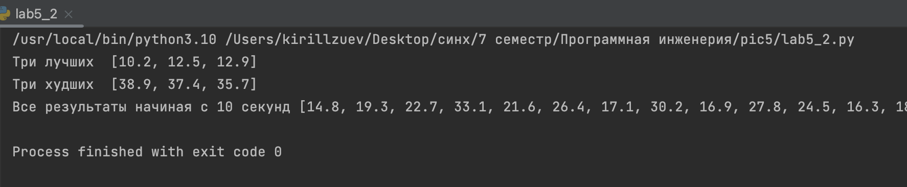
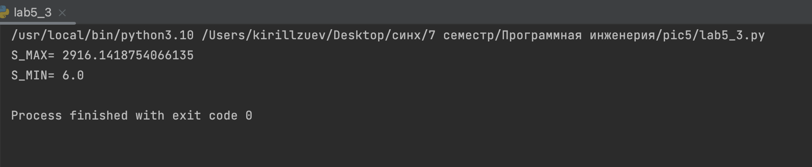
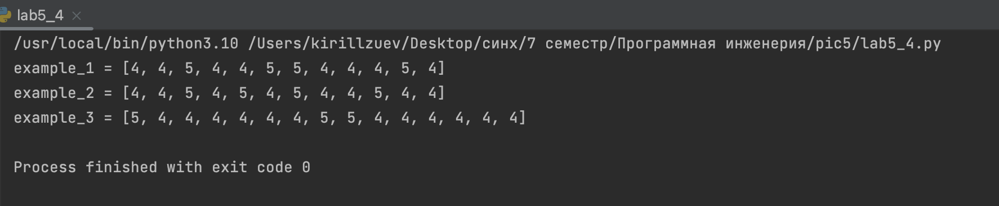
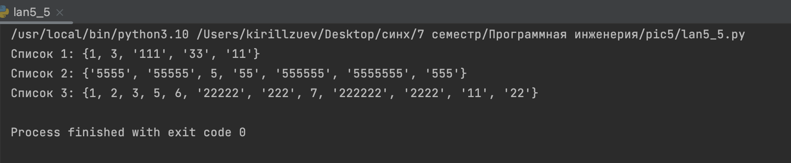

# Тема 5.Базовые коллекции: множества, списки
Отчет по Теме #5 выполнил(а):
- Зуев Кирилл Андреевич
- ЗПИЭ-20-1

| Задание | Сам_раб |
| ------ | ------ | 
| Задание 1 | + | 
| Задание 2 | +| 
| Задание 3 | + |
| Задание 4 | + | 
| Задание 5 | + | 

знак "+" - задание выполнено; знак "-" - задание не выполнено;

Работу проверили:
-  к.э.н., доцент Панов М.А.


## Самостоятельная работа №1
### Ресторан на предприятии ведет учет посещений за неделю при помощи кода работника. У них есть список со всеми посещениями за неделю.

```python
chek = [8734, 2345, 8201, 6621, 9999, 1234, 5678, 8201, 8888, 4321, 3365, 1478, 9865, 5555, 7777, 9998, 1111, 2222, 3333, 4444, 5556, 6666, 5410, 7778, 8889, 4445, 1439, 9604, 8201, 3365, 7502, 3016, 4928, 5837, 8201, 2643, 5017, 9682, 8530, 3250, 7193, 9051, 4506, 1987, 3365, 5410, 7168, 7777, 9865, 5678, 8201, 4445, 3016, 4506, 4506]

a_chek = []
for x in chek:
    if x not in chek:
        chek.append(x)
print('Количество разных людей в ресторане', len(chek))

print('Было выдано чеков', len(chek))

visit = tuple([-1, 0])
for x in chek:
    savedCode, savedCount = visit
    count = chek.count(x)
    if count > savedCount:
       visit = tuple([x, count])
print('Больше всех посетил под номером',visit[0])
```

### Результат.


## Выводы

Научился считать общее количество, создал уникальный список для счета разных людей.

## Самостоятельная работа №2
### На физкультуре студенты сдавали бег, у преподавателя физкультуры есть список всех результатов, ему нужно узнать

```python
results = [10.2, 14.8, 19.3, 22.7, 12.5, 33.1, 38.9, 21.6, 26.4, 17.1, 30.2, 35.7, 16.9, 27.8, 24.5, 16.3, 18.7, 31.9, 12.9, 37.4]
best = []
for i in range(3):
    best_result = min(results)
    best.append(best_result)
    results.remove(best_result)
print('Три лучших ', best)
worst = []
for i in range(3):
    worst_result = max(results)
    worst.append(worst_result)
    results.remove(worst_result)
print('Три худших ', worst)
more10 = []
for i in results:
    if i >= 10.01: more10.append(i)
print('Все результаты начиная с 10 секунд', more10)
```

### Результат.


## Выводы

Нашел минимальное и максимальное время результатов, а так же результаты больше 10 секунд.
Использовал min и max.

## Самостоятельная работа №3
### Преподаватель по математике придумал странную задачку. У вас есть три списка с элементами, каждый элемент которых – длина стороны треугольника, ваша задача найти площади двух треугольников, составленные из максимальных и минимальных элементов полученных списков. Результатом выполнения задачи будет: листинг кода, и вывод в консоль, в котором будут указаны два этих значения.

```python
from math import sqrt


def calc(a, b, c):
    p = (a + b + c) / 2
    return sqrt(p * (p - a) * (p - b) * (p - c))


one = [12, 25, 3, 48, 71]
two = [5, 18, 40, 62, 98]
three = [4, 21, 37, 56, 84]

print(
    'S_MAX=',
    calc(max(one), max(two), max(three))
)
print(
    'S_MIN=',
    calc(min(one), min(two), min(three))
)

```

### Результат.


## Выводы
Взял формулу нахождения площади треугольника из прошлой работы и в каждом списке нашел максимальное и минимальное значение стороны  с помощью min() и max().

## Самостоятельная работа №4
### Никто не любит получать плохие оценки, поэтому Борис решил это исправить. Допустим, что все оценки студента за семестр хранятся в одном списке. Ваша задача удалить из этого списка все двойки, а все тройки заменить на четверки.

```python
example_1 = [2, 3, 4, 5, 3, 4, 5, 2, 2, 5, 3, 4, 3, 5, 4]
example_2 = [4, 2, 3, 5, 3, 5, 4, 2, 2, 5, 4, 3, 5, 3, 4]
example_3 = [5, 4, 3, 3, 4, 3, 3, 5, 5, 3, 3, 3, 3, 4, 4]


def school_grades(results):
    new_grades = []
    for i in results:
        if i == 3:
            new_grades.append(4)
            continue
        if i == 2: continue
        new_grades.append(i)
    return new_grades


print('example_1 =', school_grades(example_1))
print('example_2 =', school_grades(example_2))
print('example_3 =', school_grades(example_3))

```

### Результат.


## Выводы

Я прошел по всему списку проверяя каждый элемент если попадается элемент 3 меняем его на 4 и добавляем в список, если 2 то удаляем.


## Самостоятельная работа №5
### Вам предоставлены списки натуральных чисел, из них необходимо сформировать множества. При этом следует соблюдать это правило: если какое-либо число повторяется, то преобразовать его в строку по следующему образцу: например, если число 4 повторяется 3 раза, то в множестве будет следующая запись: само число 4, строка «44», строка «444».

```python
list_1 = [1, 1, 3, 3, 1]
list_2 = [5, 5, 5, 5, 5, 5, 5]
list_3 = [2, 2, 1, 2, 2, 5, 6, 7, 1, 3, 2, 2]

def set1(value):
    result = set()

    while len(value) > 1:
        element = value.pop(0)
        element_count = value.count(element)
        result.add(element)
        for i in range(element_count):
            result.add(str(element) * (i + 2))

    return result

print('Список 1:', set1(list_1))
print('Список 2:', set1(list_2))
print('Список 3:', set1(list_3))
```

### Результат.


## Выводы
Я перевел список в множевство проделав необходимые  математические действия.


## Общие выводы по теме

 Изучил множевства и списки в языке python.
