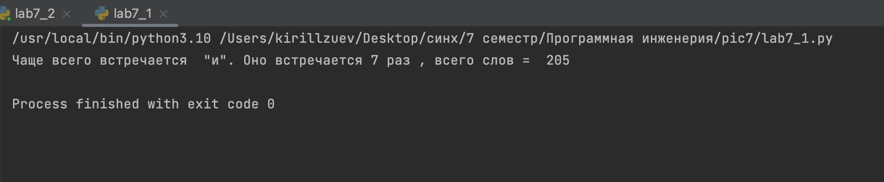
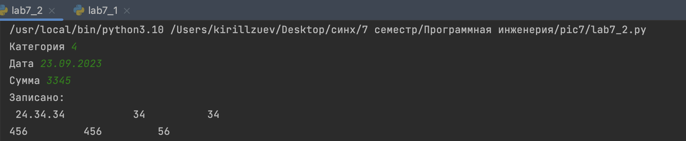
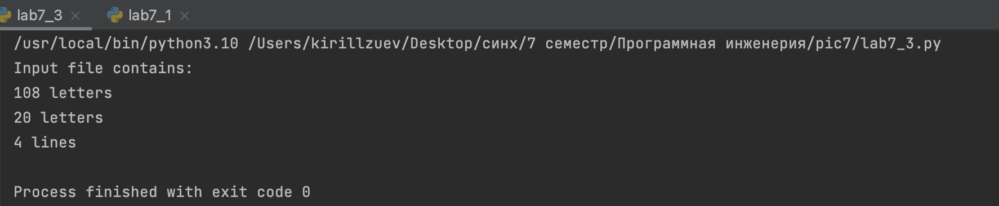
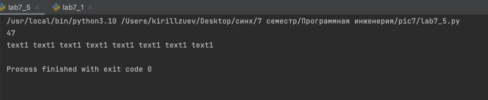

# Тема 7. Работа с файлами (ввод, вывод).
 
Отчет по Теме #7 выполнил(а):
- Зуев Кирилл Андреевич
- ЗПИЭ-20-1

| Задание | Сам_раб |
| ------ | ------ | 
| Задание 1 | + | 
| Задание 2 | +| 
| Задание 3 | + |
| Задание 4 | + | 
| Задание 5 | + | 

знак "+" - задание выполнено; знак "-" - задание не выполнено;

Работу проверили:
-  к.э.н., доцент Панов М.А.

## Самостоятельная работа №1
### Найдите в интернете любую статью (объем статьи не менее 200 слов), скопируйте ее содержимое в файл и напишите программу, которая считает количество слов в текстовом файле и определит самое часто встречающееся слово. Результатом выполнения задачи будет: скриншот файла со статьей, листинг кода, и вывод в консоль, в котором будет указана вся необходимая информация.)


```python
import re
def word(txt):
    text = {}
    for i in txt:
        if i in text: text[i] = text[i] + 1
        else: text[i] = 1
    dictionary_to_list = list(text.items())
    dictionary_to_list.sort(reverse=True, key=lambda x: x[1])

    return dictionary_to_list[0:1][0]

with open ('/Users/kirillzuev/Desktop/синх/7 семестр/Программная инженерия/pic7/n.txt', 'r') as file:
    new = file.read()
    content_without_spectial_chars = re.sub(r'[^a-zA-Zа-яА-я0-9]', '  ', new)
    spaces = re.sub(r' {2,}', ' ', content_without_spectial_chars)
    m = spaces.split(' ')
    often_word = word(m)
    print(f'Чаще всего встречается  "{often_word[0]}". Оно встречается {often_word[1]} раз '  ', всего слов = ', len(m))

```
### Результат.


## Выводы

Оформил счет имеющего текста и  нашел самое частое слово при помощи словаря.

## Самостоятельная работа №2
### У вас появилась потребность в ведении книги расходов, посмотрев все существующие варианты вы пришли к выводу что вас ничего не устраивает и нужно все делать самому. Напишите программу для учета расходов. Программа должна позволять вводить информацию о расходах, сохранять ее в файл и выводить существующие данные в консоль. Ввод информации происходит через консоль. Результатом выполнения задачи будет: скриншот файла с учетом расходов, листинг кода, и вывод в консоль, с демонстрацией работоспособности программы.

```python
with open('/Users/kirillzuev/Desktop/синх/7 семестр/Программная инженерия/pic7/1.txt', 'a') as f:
    cat = input('Категория ')
    date = input('Дата ')
    summa = int(input('Сумма '))

    f.write(f'{date}\t{cat}\t{summa}\n')

with open('/Users/kirillzuev/Desktop/синх/7 семестр/Программная инженерия/pic7/1.txt', 'r') as f:
    print('Записано:\n', f.read())

```
### Результат.

## Выводы

Создал пользовательский ввод с клавиатуры далее запись  введенной информации в текстовый файл.

## Самостоятельная работа №3
### Имеется файл input.txt с текстом на латинице. Напишите программу, которая выводит следующую статистику по тексту: количество букв латинского алфавита; число слов; число строк.


```python
abc = ['a', 'b', 'c', 'd', 'e', 'f', 'g', 'h', 'i', 'k', 'l', 'm', 'n', 'o', 'p', 'q', 'r', 's', 't', 'u', 'v', 'x', 'y', 'z']

with open('/Users/kirillzuev/Desktop/синх/7 семестр/Программная инженерия/pic7/6.txt', 'r') as f:
    lines = f.readlines()
    letters = 0
    words = 0

    for line in lines:
        for word in line.strip():
            if word.lower() in abc:
                letters += 1
        words += len(line.split(' '))

    print('Input file contains:')
    print(f'{letters} letters')
    print(f'{words} letters')
    print(f'{len(lines)} lines')

```
### Результат.

## Выводы

Научился работать с файлом и проводить операции по ним.

## Самостоятельная работа №4
### Напишите программу, которая получает на вход предложение, выводит его в терминал, заменяя все запрещенные слова звездочками * (количество звездочек равно количеству букв в слове). Запрещенные слова, разделенные символом пробела, хранятся в текстовом файле input.txt. Все слова в этом файле записаны в нижнем регистре. Программа должна заменить запрещенные слова, где бы они ни встречались, даже в середине другого слова. Замена производится независимо от регистра: если файл input.txt содержит запрещенное слово exam, то слова exam, Exam, ExaM, EXAM и exAm должны быть заменены на ****.


```python
x= 'Hello, world! Python IS the programming language of thE future. My\nEMAIL is....\nPYTHON is awesome!!!!'

with open('/Users/kirillzuev/Desktop/синх/7 семестр/Программная инженерия/pic7/text.txt', 'r') as f:
    word = f.read().split(' ')
    text = x.lower()
    for word in word:
        text = text.replace(word, '*' * len(word))
    y = ''
    for i, word in enumerate(text):
        if x[i].lower() == word:
            y += x[i]
        else:
            y += word

    print(y)

```
### Результат.


## Выводы

Я перевел строки к нижнему регистру заменил слова из файла и вернул обратно регист. 

   
## Самостоятельная работа №5
### Самостоятельно придумать задачу. Давайте запишем в файл file.txt строку 'text1 text1 text1 text1 text1 text1 text1 text1', а затем прочитаем его содержимое:
```python
res = open('file1.txt', 'w')
print(res.write('text1 text1 text1 text1 text1 text1 text1 text1'))

res = open('file1.txt', 'r')
print(res.read())
```
### Результат.

## Выводы

Открываем или создаем файл и записываем туда нужную информацию и читаем его содержание выводя количество символов.


## Общие выводы по теме
Научился работать с файлами: создавать, читать, записывать.


