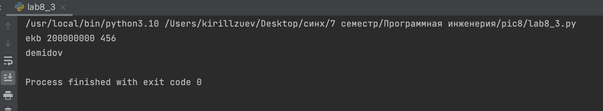
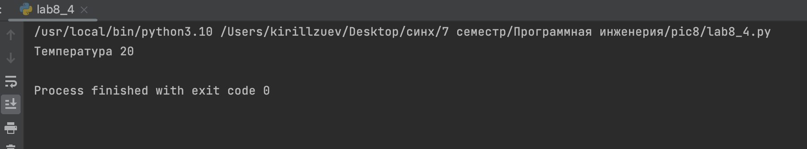

# Тема 8. Введение в ООП
Отчет по Теме #8 выполнил(а):
- Зуев Кирилл Андреевич
- ЗПИЭ-20-1

| Задание | Сам_раб |
| ------ | ------ | 
| Задание 1 | + | 
| Задание 2 | +| 
| Задание 3 | + |
| Задание 4 | + | 
| Задание 5 | + | 

знак "+" - задание выполнено; знак "-" - задание не выполнено;

Работу проверили:
-  к.э.н., доцент Панов М.А.

## Самостоятельная работа №1
### Самостоятельно создайте класс и его объект. Они должны отличаться, от тех, что указаны в теоретическом материале (методичке) и лабораторных заданиях. Результатом выполнения задания будет листинг кода и получившийся вывод консоли.


```python
class sity:
    def __init__(self, name,population):
        self.name = name
        self.population = population

sity = sity('ekb', 200000000)

print(sity.name , sity.population)

```
### Результат.

## Выводы

Создал класс и обьект.

## Самостоятельная работа №2
### Самостоятельно создайте атрибуты и методы для ранее созданного класса. Они должны отличаться, от тех, что указаны в теоретическом материале (методичке) и лабораторных заданиях. Результатом выполнения задания будет листинг кода и получившийся вывод консоли.


```python
class sity:
    def __init__(self, name,population,new):
        self.name = name
        self.population = population
        self.new = new
    def new(self):
        print(f'new {self.new}')

sity = sity('ekb', 200000000, 456)
print(sity.name , sity.population,  sity.new)


```
### Результат.

## Выводы

Создал атрибуты используя предыдущий код.


## Самостоятельная работа №3
### Самостоятельно реализуйте наследование, продолжая работать с ранее созданным классом. Оно должно отличаться, от того, что указано в теоретическом материале (методичке) и лабораторных заданиях. Результатом выполнения задания будет листинг кода и получившийся вывод консоли.


```python
class sity:
    def __init__(self, name,population,new):
        self.name = name
        self.population = population
        self.new = new
    def new(self):
        print(f'new {self.new}')

class sityy(sity):
    def __init__(self, name, population, new):
        super().__init__(name, population, new)

    def aaa(self):
        print('demidov')

sity = sityy('ekb', 200000000, 456)

print(sity.name, sity.population, sity.new)
sity.aaa()


```
### Результат.

## Выводы

Реализовал наследование.

## Самостоятельная работа №4
### Самостоятельно реализуйте инкапсуляцию, продолжая работать с ранее созданным классом. Она должна отличаться, от того, что указана в теоретическом материале (методичке) и лабораторных заданиях. Результатом выполнения задания будет листинг кода и получившийся вывод консоли.


```python
class sity:
    def __init__(self, name,population,new):
        self.name = name
        self.population = population
        self.new = new
    def new(self):
        print(f'new {self.new}')

class sityy(sity):
    def __init__(self, name, population, new,temp):
        super().__init__(name, population, new)
        super().__init__(name, population, new)
        self.__temp = temp

    def aaa(self):
            print('demidov')
    def gradus(self):
            print(f'Температура {self.__temp}')


sity = sityy('ekb', 200000000, 45, 20)
sity.gradus()

```
### Результат.


## Выводы

Реализовал инкапсуляцию. 

   
## Самостоятельная работа №5
### Самостоятельно реализуйте полиморфизм. Он должен отличаться, от того, что указан в теоретическом материале (методичке) и лабораторных заданиях. Результатом выполнения задания будет листинг кода и получившийся вывод консоли.


```python
class sity:
    def populathin(self):
        pass

class ekb(sity):
    def populathin(self):
        print('Население 1 300 000')

class perm(sity):
    def populathin(self):
        print('Население 1 100 000')

ekb = ekb()
perm = perm()

ekb.populathin()
perm.populathin()

```
### Результат.

## Выводы

Создал полиморфизм.


## Общие выводы по теме
Рассмотрел общие концепции ООП.

