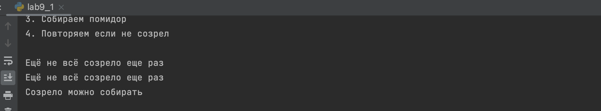

# Тема 9. Концепции и принципы ООП.
Отчет по Теме #9 выполнил(а):
- Зуев Кирилл Андреевич
- ЗПИЭ-20-1

| Задание | Сам_раб |
| ------ | ------ | 
| Задание 1 | + | 

знак "+" - задание выполнено; знак "-" - задание не выполнено;

Работу проверили:
-  к.э.н., доцент Панов М.А.

## Самостоятельная работа №1
### Задание Садовник и помидоры.

```python
class Tomato:
    states = ['none', 'growing', 'greed', 'red']
    def __init__(self, index):
        self._index = index
        self._state = Tomato.states[0]
    def grow(self):
        current_index = Tomato.states.index(self._state)

        if len(Tomato.states) - 1 > current_index:
            self._state = Tomato.states[current_index + 1]
        else:
            print('Дальше расти не будет тк некуда')

    def is_ripe(self):
        return self._state == Tomato.states[-1]
class TomatoBush:
    def __init__(self, count_tomatoes):
        tomatoes = []
        for i in range(count_tomatoes):
            tomatoes.append(Tomato(i))
        self.tomatoes = tomatoes

    def grow_all(self):
        for tomato in self.tomatoes:
            tomato.grow()

    def all_are_ripe(self):
        for i in self.tomatoes:
            if not i.is_ripe():
                return False

        return True

    def give_away_all(self):
        self.tomatoes.clear()

class Gardener:
    def __init__(self, name, plant):
        self.name = name 
        self._plant = plant

    def work(self):
        self._plant.grow_all()

    def harvest(self):
        if self._plant.all_are_ripe():
            print('Созрело можно собирать')
            self._plant.give_away_all()
        else:
            print('Ещё не всё созрело еще раз')

    @staticmethod
    def knowledge_base():
        print('1. Сажаем помидор\n2. Растим помидор\n3. Собираем помидор\n4. Повторяем если не созрел\n')

# вывод справочной
Gardener.knowledge_base()
# создание экземпляра куста помидоров
tomato_bush = TomatoBush(1)
# создание экземпляра садовника
gardener = Gardener('Ivan', tomato_bush)
# Создаем и растим помидоры
gardener.work()
# пробуем их собрать, но они еще не выросли
gardener.harvest()
# продолжаем растить
gardener.work()
# снова пробуем их собрать, но они так и не выросли
gardener.harvest()
# продолжаем растить
gardener.work()
# собираем помидоры, ура они выросли
gardener.harvest()

```
### Результат.


## Общие выводы по теме
Я  научился разбивать приложение на логические блоки.


